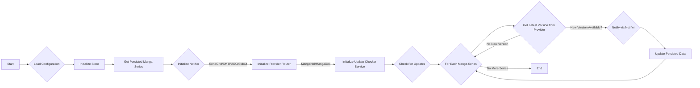

<h3 align="center"></h3>

## Add a new series to check for updates
```sh
## make a folder inside the data folder with the title name
mkdir data/one-piece
## copy the title template inside as data.json
cp data/title.json.tpl data/one-piece/data.json 
```
Copy the slug from the url of the series e.g. https://manganel.me/manga/unexpected-accident has the slug of "unexpected-accident" inside the data.json file.

# Manga Updates

This project started as a simple idea: to keep tabs on my favorite manga series and get a heads-up (via Email) whenever a new chapter dropped. The initial thought was to manage everything through a GitHub repository, with updates triggered by a scheduled GitHub Actions Workflow.

But hey, there's nothing stopping you from running this locally on your machine! Plus, it's built with extensibility in mind, so feel free to tweak it or add your own twists.

## Components and Support

Currently, the application supports the following core components:

### Provider
- **MangaNel:** Fetches updates from MangaNel.
- **MangaDex:** Fetches updates from MangaDex.

### Notifier 
- **SendGrid:** Sends email notifications via SendGrid.
- **SMTP2GO:** Sends email notifications via SMTP2GO.
- **Standard Output:** Prints notifications directly to the console (useful for testing and debugging).

### Store
- **Local files (JSON):** Manga series data is stored and managed in local JSON files within the `data` directory.

These components are all extendable, and you are more than welcome to contribute!

## Program Flow (Mermaid Diagram)



## How to Run / How to Contribute

To set up and run the `manga-updates` application for development, follow these steps:

### 1. Clone the Repository

```bash
git clone https://github.com/ivan-penchev/manga-updates.git
cd manga-updates
```

### 2. Set Up Environment Variables

The application relies on several environment variables for configuration. Create a `local.env` file in the config folder. 
You can use the tpl available there.

```sh
cp ./config/local.tpl ./config/local.env
```

### 3. Run Chrome headless (for MangaNel Provider)

The MangaNel provider utilizes `chromedp` to interact with a headless Chrome instance. For local development or testing, you can run a headless Chrome browser in a Docker container.

 ```bash
    docker run -d -p 3000:3000 ghcr.io/browserless/chromium
 ```

This command starts a headless Chrome instance, exposing its DevTools Protocol.
The `manga-updates` application will automatically connect to this remote instance if `remoteURL` is set to `ws://127.0.0.1:3000`.

### 4. Run the Program


You have two primary ways to run the `manga-updates` application:


#### a) Using VS Code (Recommended for Development)


If you are using VS Code, you can leverage its integrated debugging and task running capabilities. Ensure your environment variables are set up in a `.env` file (as described in step 2) or directly in your VS Code launch configuration. VS Code will automatically pick up these variables when you run or debug the application.


#### b) Using `go run` (Command Line)


To run the application directly from your terminal using `go run`, you must ensure that all necessary environment variables are exposed in your shell session. You can do this by sourcing your `.env` file (if you created one) or by setting them individually.


Example of sourcing a `.env` file (assuming you named it `local.env` in the `config` folder as per step 2):


```bash

source config/local.env

go run cmd/manga-updates/main.go

```


Alternatively, set variables individually:


```bash

export NOTIFICATION_EMAIL_RECIPIENT="your_email@example.com"

export NOTIFICATION_EMAIL_SENDER="sender@example.com"

# ... other variables

go run cmd/manga-updates/main.go

```


The application will then check for updates for your configured manga series and send notifications if new chapters are found.